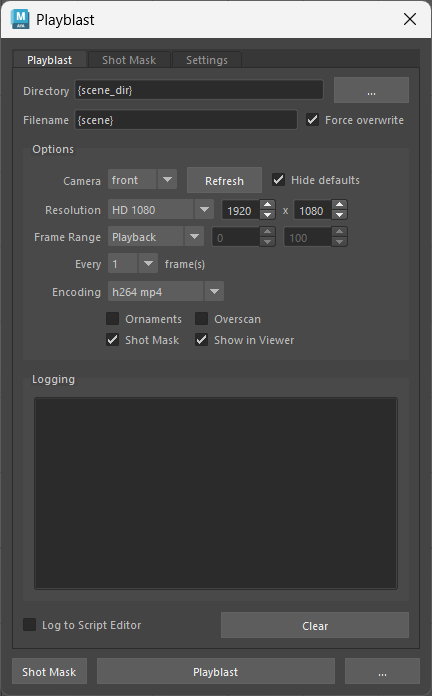
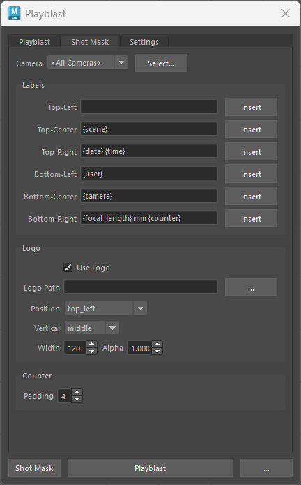
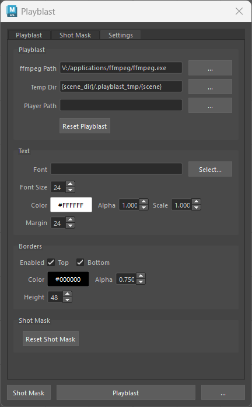

# Blueprint Playblast: End-User Configuration Guide

This tutorial explains how to configure Blueprint Playblast in Maya, build dynamic file names and burn-ins with variables such as `{scene}` and `{focal_length}`, and save personal or studio defaults.

## Quick start

1. Open **Blueprint Playblast** in Maya.
2. On **Playblast**, choose the output, camera, resolution, frame range, and encoding.
3. Enable **Shot Mask** if you want labels, bars, or a logo.
4. On **Settings**, confirm the FFmpeg path.
5. Click **Playblast**.

The supplied defaults create an H.264 MP4 named after the scene. A scene named `sq010_sh020_anim_v003.ma` produces `sq010_sh020_anim_v003.mp4`.



## Variables and templates

Variables are replaced when a playblast is created. They can be mixed with normal text:

```text
{scene}_{camera}_{date}
```

For scene `sq010_sh020_anim_v003`, camera `shotCam`, and date 2026-07-09, that becomes `sq010_sh020_anim_v003_shotCam_2026-07-09`.

Use the exact, case-sensitive spelling below. Focal length is `{focal_length}`, not `{focallength}`.

| Variable | Value | Example |
| --- | --- | --- |
| `{project}` | Current Maya workspace root | `D:\shows\MyShow` |
| `{scene}` | Scene filename without extension | `sq010_sh020_anim_v003` |
| `{scene_dir}` | Folder containing the scene | `D:\shows\MyShow\scenes\sq010` |
| `{scene_path}` | Complete scene path and filename | `D:\shows\MyShow\scenes\sq010\shot.ma` |
| `{camera}` | Camera transform selected in the tool | `shotCam` |
| `{focal_length}` | Camera focal length, rounded to two decimals | `35.0` |
| `{user}` | Operating-system user name | `artist01` |
| `{date}` | Current date (`YYYY-MM-DD`) | `2026-07-09` |
| `{time}` | Current local time (`HH:MM`, 24-hour) | `14:35` |
| `{frame}` | Timeline frame in a shot-mask label | `1001` |
| `{counter}` | Same value as `{frame}` in a shot-mask label | `1001` |

If the scene is unsaved, `{scene}` becomes `untitled`, `{scene_path}` is empty, and `{scene_dir}` falls back to the Maya project root.

`{frame}` and `{counter}` are intended for shot-mask labels. Both show the actual timeline frame, beginning at the playblast start frame. **Counter > Padding** controls their leading zeroes.

The label **Insert** menu contains the common variables and **New Line**. `{scene_path}` also works, although it is not currently shown in that menu; type it manually.

### Fields that support variables

- Output **Directory** and **Filename**
- All six shot-mask labels
- Shot-mask **Logo Path**
- **Temp Dir**, **Player Path**, and **Font**

**FFmpeg Path** must be a direct executable path; variables are not expanded there.

### Template recipes

Save beside the Maya scene:

```yaml
directory: '{scene_dir}'
filename: '{scene}'
```

Organize review files by artist:

```yaml
directory: '{project}/playblasts/{user}'
filename: '{scene}_{camera}_{date}'
```

Use a separate temporary drive:

```yaml
temp_dir: 'D:/playblast_temp/{user}/{scene}'
```

Create a two-line label:

```text
{camera}\n{focal_length} mm
```

Type `\n` literally or choose **Insert > New Line**. Empty lines are discarded.

## Playblast tab

### Output

**Directory** is the output folder. If empty, it falls back to `{scene_dir}`. Missing folders are created automatically. The old values `{project}/playblast` and `{project}/playblasts` are automatically treated as `{scene_dir}` for compatibility.

**Filename** supports text and variables. If it has no extension, the tool adds `.mp4` for MP4 encoding and `.mov` for other encodings.

**Force overwrite** replaces an existing output. If disabled, the playblast stops when the target already exists.

### Camera

**Camera** supplies `{camera}`, `{focal_length}`, and shot-mask values. **Hide defaults** excludes Maya's `front`, `persp`, `side`, and `top` cameras. Click **Refresh** after adding or renaming cameras.

For reliable capture in the current version, activate the intended camera in the focused model panel before clicking **Playblast**. See [Current limitations](#current-limitations).

### Resolution

| Preset | Size |
| --- | --- |
| HD 540 | 960 × 540 |
| HD 720 | 1280 × 720 |
| HD 1080 | 1920 × 1080 |
| Square 1080 | 1080 × 1080 |
| UHD 4K | 3840 × 2160 |
| Custom | User-entered width and height |

A non-preset width/height is saved as **Custom**. The UI accepts dimensions from 1 to 16384 pixels.

### Frame range

| Mode | Frames used |
| --- | --- |
| Playback | Playback minimum and maximum |
| Render | Render Globals start and end |
| Animation | Animation start and end |
| Selected | Highlighted time-slider range; Playback if nothing is selected |
| Custom | Entered Start and End values |

**Every _n_ frame(s)** captures every 1st through 5th frame. `2`, for example, captures 1001, 1003, 1005, and so on.

### Encoding, frame rate, and audio

- **h264 mp4** creates H.264 MP4 using CRF 18, the medium preset, and `yuv420p`.
- **h264 mov** creates an H.264 MOV using `yuv420p`.
- **png sequence** writes PNG files through FFmpeg. Give the filename an image-sequence pattern and extension, such as `{scene}.%04d.png`.

Frame rate follows Maya's time unit: Film 24, PAL 25, NTSC 30, Show 48, PAL Field 50, or NTSC Field 60 fps. Other units fall back to 24 fps.

Audio assigned to Maya's playback slider is trimmed and synchronized automatically for MP4 and MOV. If none is assigned, the first audio node is used when available. PNG sequences have no audio.

### Switches

- **Ornaments** includes Maya viewport ornaments.
- **Shot Mask** enables labels, bars, and logo.
- **Show in Viewer** opens the completed output.
- **Log to Script Editor** mirrors the window log to Maya's Script Editor.
- **Overscan** is saved but not currently applied; see [Current limitations](#current-limitations).

## Shot Mask tab



### Labels

There are six independent zones:

```text
top_left       top_center       top_right
bottom_left    bottom_center    bottom_right
```

Each accepts plain text, variables, and multiple lines. Leave a field empty to hide it.

```yaml
labels:
  top_left: 'INTERNAL REVIEW'
  top_center: '{scene}'
  top_right: '{date} {time}'
  bottom_left: '{user}'
  bottom_center: '{camera}'
  bottom_right: '{focal_length} mm {counter}'
```

### Counter

**Padding** sets the minimum digits for `{frame}` and `{counter}`. Padding `4` displays frame 1 as `0001`; padding `6` displays `000001`. The range is 1–12.

### Logo

- **Use Logo** toggles the logo without deleting its path.
- **Logo Path** accepts PNG, JPEG, TIFF, or BMP and supports variables.
- **Position** supports all six label-style zones.
- **Vertical: middle** centers the logo inside its bar.
- **Vertical: edge** touches the top or bottom image edge.
- **Width** scales in pixels while preserving aspect ratio.
- **Alpha** ranges from `0` (invisible) to `1` (opaque).

A missing logo file is skipped. Transparent PNG is usually the best format.

## Settings tab



### FFmpeg and temporary files

Set **FFmpeg Path** to the executable, for example:

```text
V:\applications\ffmpeg\ffmpeg.exe
```

FFmpeg is required for H.264, shot masks, logos, and PNG conversion. An invalid path stops the playblast with an error.

**Temp Dir** stores captured PNGs before encoding. A unique folder is made per run and removed afterward. Choose a location with enough space for a full-resolution sequence.

```text
{scene_dir}/.playblast_tmp/{scene}
```

### Movie player

Leave **Player Path** empty for the system default. Set an executable to force RV, DJV, VLC, or another review tool:

```text
C:\Program Files\VideoLAN\VLC\vlc.exe
```

It is used only when **Show in Viewer** is enabled.

### Text appearance

- **Font** accepts `.ttf`, `.otf`, and `.ttc`. If empty, the tool tries Arial, Segoe UI, then Calibri on Windows.
- **Font Size** is the base pixel size.
- **Scale** multiplies it; size 24 at scale 1.5 renders at 36 pixels.
- **Color** uses hexadecimal notation such as `#FFFFFF`.
- **Alpha** ranges from 0 to 1.
- **Margin** is the horizontal inset for left/right labels and logos.

### Bars

- **Top** and **Bottom** enable each background bar.
- **Color** uses hexadecimal notation such as `#000000`.
- **Alpha** ranges from 0 to 1.
- **Height** is in pixels.

Labels and logos can still draw when their bar is disabled; only the colored background disappears.

## Saving, resetting, and shelf setup

Open the **…** menu:

- **Save Settings** saves personal overrides.
- **Clear User Overrides** removes them and reloads studio defaults.
- **Create Shelf Button** adds Playblast to the selected Maya shelf.
- **Save Studio Defaults** appears only in admin mode.

Clicking **Playblast** also saves the current UI choices first.

**Reset Playblast** restores Playblast values plus FFmpeg and Temp Dir from studio settings. **Reset Shot Mask** restores the mask, text, bars, and logo. Both reset actions update personal overrides. Player Path is not part of Reset Playblast.

## Configuration layers and file locations

Settings load in this order:

1. Built-in fallbacks in `settings.py`
2. Studio `settings.yaml` beside the tool
3. Personal `user_settings.yaml`

Later values win only for keys they contain. The personal file stores only differences from studio settings, so new studio defaults reach users unless that exact value was overridden.

The default personal path is:

```text
<Maya user application directory>/playblast/user_settings.yaml
```

A pipeline can redirect it before Maya starts:

```text
PLAYBLAST_USER_SETTINGS=D:\configs\artist01_playblast.yaml
```

This names a file. Alternatively:

```text
PLAYBLAST_USER_CONFIG_DIR=D:\configs\artist01
```

This writes `user_settings.yaml` in that folder. `PLAYBLAST_USER_SETTINGS` wins if both exist.

If studio YAML is absent or empty, the tool can load the older `settings.json` beside it.

## Editing YAML manually

Most artists should use the UI. A TD can edit `settings.yaml` or use admin mode. Complete example:

```yaml
playblast:
  camera: ''
  directory: '{project}/playblasts'
  encoding: h264 mp4
  end_frame: 100
  filename: '{scene}'
  force_overwrite: true
  frame_range: Playback
  resolution_preset: HD 1080
  height: 1080
  width: 1920
  hide_default_cameras: true
  log_to_script_editor: false
  overscan: false
  shot_mask: true
  show_in_viewer: true
  show_ornaments: false
  start_frame: 1
  step: 1
settings:
  ffmpeg_path: 'V:/applications/ffmpeg/ffmpeg.exe'
  player_path: ''
  temp_dir: '{scene_dir}/.playblast_tmp/{scene}'
shot_mask:
  bar_alpha: 0.75
  bar_color: '#000000'
  bar_height: 48
  bottom_bar: true
  camera_scope: <All Cameras>
  counter_padding: 4
  font_path: ''
  font_size: 24
  text_alpha: 1.0
  text_color: '#FFFFFF'
  text_scale: 1.0
  margin: 24
  labels:
    bottom_center: '{camera}'
    bottom_left: '{user}'
    bottom_right: '{focal_length} mm {counter}'
    top_center: '{scene}'
    top_left: ''
    top_right: '{date} {time}'
  logo_alpha: 1.0
  logo_path: ''
  logo_position: top_left
  logo_vertical_align: middle
  logo_width: 120
  top_bar: true
  use_logo: true
```

The small built-in YAML reader supports nested dictionaries, strings, numbers, booleans, empty strings, `null`/`none`, blank lines, and full-line `#` comments.

Do not use lists, anchors, aliases, tags, inline dictionaries, or multiline block syntax. Quote values containing variables, `#`, `:`, or backslashes. Indent with spaces as shown.

### Studio/admin mode

Set this before launching Maya:

```text
PLAYBLAST_ADMIN=1
```

`true`, `yes`, `on`, and `supervisor` also work, case-insensitively. Admin mode reveals **Save Studio Defaults**, which writes the complete merged UI state to studio `settings.yaml`. Normal saves write only personal differences.

## Current limitations

These visible/configured controls are not fully connected yet:

- **Overscan** is saved but does not alter capture.
- Shot Mask **Camera** / `camera_scope` is saved but does not limit the mask to one camera.
- The selected Playblast **Camera** supplies `{camera}` and `{focal_length}`, but is not passed directly to Maya's capture command. Capture follows the active/focused model panel; activate the intended camera before running.

Unknown variables stay unchanged. `{shot}`, for example, remains literal because no such variable is defined.

## Troubleshooting

**Focal length is blank:** Select a valid Maya camera transform and use `{focal_length}` exactly.

**Wrong camera was captured:** Activate the desired camera in the focused model panel immediately before playblasting.

**Output already exists:** Enable **Force overwrite**, change the name, or add `{date}`/`{time}`.

**FFmpeg was not found:** Set a valid direct executable under **Settings > FFmpeg Path**. Variables do not work there.

**Logo is missing:** Enable **Use Logo** and **Shot Mask**, then verify the resolved image path.

**Label falls outside its bar:** Increase **Bar Height**, reduce font size/scale, or use fewer lines.

**Personal values hide new studio defaults:** Choose **… > Clear User Overrides**, then reapply only needed preferences.
